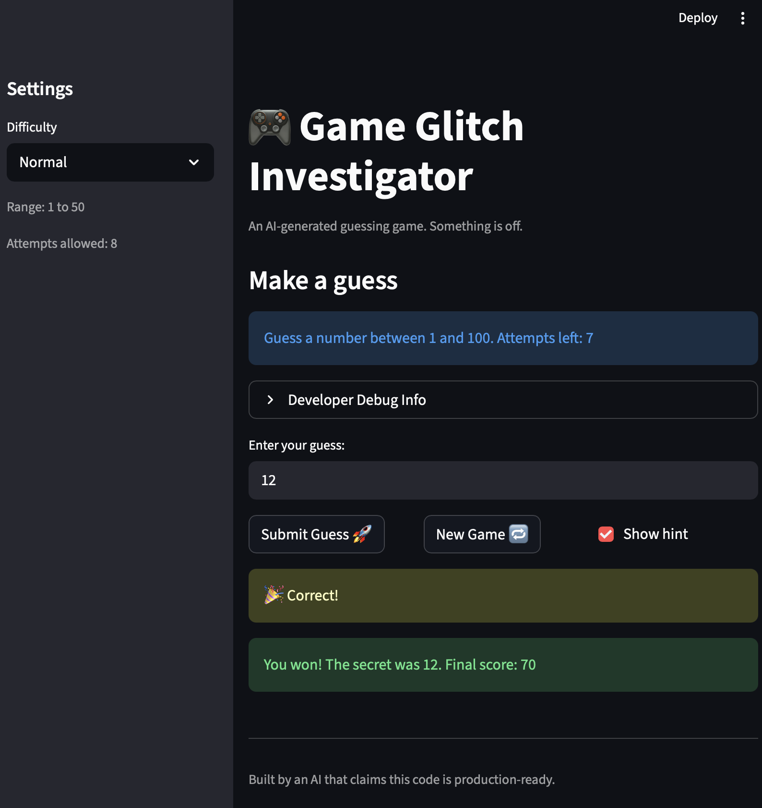

# 🎮 Game Glitch Investigator: The Impossible Guesser

## 🚨 The Situation

You asked an AI to build a simple "Number Guessing Game" using Streamlit.
It wrote the code, ran away, and now the game is unplayable. 

- You can't win.
- The hints lie to you.
- The secret number seems to have commitment issues.

## 🛠️ Setup

1. Install dependencies: `pip install -r requirements.txt`
2. Run the broken app: `python -m streamlit run app.py`

## 🕵️‍♂️ Your Mission

1. **Play the game.** Open the "Developer Debug Info" tab in the app to see the secret number. Try to win.
2. **Find the State Bug.** Why does the secret number change every time you click "Submit"? Ask ChatGPT: *"How do I keep a variable from resetting in Streamlit when I click a button?"*
3. **Fix the Logic.** The hints ("Higher/Lower") are wrong. Fix them.
4. **Refactor & Test.** - Move the logic into `logic_utils.py`.
   - Run `pytest` in your terminal.
   - Keep fixing until all tests pass!

## 📝 Document Your Experience

-Game's purpose:
Glitchy Guesser is a number guessing game where you try to figure out a secret number within a limited number of attempts — the app gives you hints after each guess to guide you higher or lower.

Bugs found:
The hints were backwards (guessing too high told you to go higher), the secret was sometimes compared as a string instead of a number making hints completely wrong, the New Game button didn't actually reset the game, difficulty levels used the wrong number ranges, and the score could go negative.

Fixes applied:
Swapped the hint messages so they point the right direction, removed the string/int type mismatch so comparisons are always numeric, fixed the New Game button to reset status and history, corrected the number ranges per difficulty, and added a score floor of 0 so it can never go negative.

## 📸 Demo

- 

## 🚀 Stretch Features

